<a name="readme-top"></a>

<!-- TABLE OF CONTENTS -->

# 📗 Table of Contents

- [📖 About the Project](#about-project)
  - [🛠 Built With](#built-with)
    - [Tech Stack](#tech-stack)
    - [Key Features](#key-features)
- [💻 Getting Started](#getting-started)
  - [Prerequisites](#prerequisites)
  - [Setup](#setup)
  - [Install](#install)
  - [Usage](#usage)
  - [Run tests](#run-tests)
  - [Deployment](#deployment)
- [👥 Authors](#authors)
- [🔭 Future Features](#future-features)
- [🤝 Contributing](#contributing)
- [⭐️ Show your support](#support)
- [🙏 Acknowledgements](#acknowledgements)
- [📝 License](#license)

<!-- PROJECT DESCRIPTION -->

# 📖 Task 1 Documentation

This section provides a complete, step-by-step guide to Task 1 as outlined in challenge document. Task 1's objective is to establish the local development environment and gain a thorough theoretical understanding of MCP (Model Context Protocol, a standardized way for AI agents to access tools) and A2A (Agent-to-Agent Protocol, for secure communication between agents).

## Step 1: Choose Agent Path
- **Definition**: The *Agent Path* refers to selecting a programming framework for building AI agents. Options were **Python** (using fast-agent) or **NodeJS** (using LangGraph.js). NodeJS is a runtime environment that allows JavaScript to be executed on the server-side, enabling asynchronous operations ideal for AI tasks.
- **What was done**: NodeJS (LangGraph.js) was chosen for this setup.
- **Why this step**: This decision determines the tools and dependencies for the project.

## Step 2: Setup Environment
- **Definition**: Environment setup involves preparing local machine with necessary software tools to run the project. This includes cloning a repository (copying a remote codebase to our local machine using Git) or creating a project structure, installing dependencies (software packages required for the project), and verifying they work.

- **Prerequisites**: Ensuring a terminal and basic tools installed.
<br/>

- **Sub-step 2.1: Clone or Create Project Structure**
  - **Explanation**: If a starter repository is provided, clone it using Git. Otherwise, create a new project folder. In this case, the workspace is at ```file_path```.

  - **Command**: Run `git clone <repository_url>` if available, or manually create the directory.
  - **What was done**: Created an empty repository for Gitflow purpose and the project structure was created in the cloned workspace.
<br/>

- **Sub-step 2.2: Install Base Dependencies**
  - **Definition**: Dependencies are external libraries or tools needed for the project. For NodeJS, this includes NodeJS itself, npm (Node Package Manager, a tool for managing JavaScript packages), Git (for version control), and Docker (a containerization platform that packages applications and their dependencies for consistent execution).
  - **Installation Steps**:
    - First, update system package list:
      - `sudo apt update` (this refreshes the list of available software packages on your Linux system).

    - Install NodeJS using NVM (Node Version Manager, a tool to install and manage multiple NodeJS versions): 
      - `curl -o- https://raw.githubusercontent.com/nvm-sh/nvm/v0.39.7/install.sh | bash`, then `source ~/.bashrc` to apply changes, and `nvm install 18` to install NodeJS version 18 (a specific, stable version chosen for compatibility).
    - Install Git: 
        - `sudo apt install -y git` 
    - Install Docker: 
        - `sudo apt purge -y docker.io containerd` to remove any conflicting packages, then `curl -fsSL https://get.docker.com -o get-docker.sh && sh get-docker.sh` to download and execute the official Docker installation script.
<br/>
  - **Verification**: After installation, check versions:
     - ```node -v``` (displays NodeJS version, e.g., v18.20.8), 
     - ```npm -v``` (displays npm version, e.g., 10.8.2), 
     - ```git --version``` (displays Git version), and 
     - ```docker --version``` (displays Docker version, e.g., 28.2.2).
<br/>
- **Sub-step 2.3: Initialize NodeJS Project**
  - **Explanation**: This creates a package.json file (a configuration file for NodeJS projects that lists dependencies and scripts).
  - **Command**: Run ```npm init -y``` (this initializes the project and creates package.json with default settings).

## Step 3: Create Mock KB
- **Definition**: Mock KB (Knowledge Base) is a simulated directory structure for testing RAG (Retrieval-Augmented Generation, a technique where AI models retrieve and use external data to generate responses). Appendix D provides instructions for this.
- **Steps**:
  - Create base directory: Run `mkdir -p mock_knowledge_base` (this command creates the directory and any necessary parent directories; the -p flag ensures no error if it already exists).
  - Create subdirectories and files.
  - **What was done**: These files were populated with sample data as per Appendix.

## Step 4: MCP/A2A Deep Dive
- **Definition**: This involves reading official specifications for MCP and A2A to understand their structures. MCP focuses on agent-tool interactions, while A2A is for agent-agent communication.
- **Steps**: Review the MCP and A2A docs from Appendix A. Focus on request/response structures (e.g., MCP's ```invoke_method``` is a standardized way to call tools).
- **What was done**: Read and studied the specs.

## Step 5: Explore Target MCP Servers
- **Definition**: Target MCP servers (e.g., GitHub MCP, Filesystem MCP) are pre-built servers that wrap tools for standardized access. Each has READMEs explaining setup, often using Docker for containerized running.
- **Steps**: Review code and READMEs for servers like GitHub, Filesystem, Google Drive, and Atlassian. Note default ports (e.g., 8000 for local access).
- **What was done**: Explored their purpose and setup instructions.

## Step 6: Document Understanding
- **Explanation**: This updated protocols_understanding.md with explanations of MCP ```invoke_method``` flow, MCP vs. A2A contrasts, and server summaries.
- **What was done**: Edits were made to protocols_understanding.md as detailed.

## Complete Workspace Structure for task-1

```mermaid
graph TD
    A[mcp_integration_rag_foundations] --> B[README.md]
    A --> D[package.json]
    A --> E[get-docker.sh]
    A --> F[protocol_understanding.md]
    A --> I[.gitignore]
    A --> J[requirements.txt]
    A --> L[MIT.md]
    A --> N[📁 .git]
    A --> O[📁 mock_knowledge_base]
        O --> P[jira_tickets.json]
        O --> Q[📁 code]
            Q --> R[commit_abc123.py]
            Q --> S[commit_def456.py]
        O --> T[📁 docs]
            T --> U[login_feature.md]
            T --> V[ui_guidelines.md]
            T --> W[mcp_server_design.md]
            T --> X[task_api_spec.md]
            T --> Y[a2a_spec.md]
        O --> Z[📁 tickets]
            Z --> AA[NEX-123.txt]
            Z --> AB[NEX-456.txt]
            Z --> AC[NEX-789.txt]
    A --> AD[📁 venv]
```



## 🛠 Built With <a name="built-with"></a>

### Tech Stack <a name="tech-stack"></a>

- **Client/Server**: NodeJS (for running the agent framework LangGraph.js)
- **Tools**: Git (for version control), Docker (for containerized environments), npm (for package management)

### Key Features <a name="key-features"></a>

- Environment setup for MCP and A2A protocols
- Creation of mock knowledge base for RAG testing
- Installation and verification of dependencies like NodeJS and Docker


## 💻 Getting Started <a name="getting-started"></a>

To get a local copy up and running, follow these steps.

### Prerequisites

In order to run this project, you need:
- NodeJS (version 18 or later)
- Git
- Docker
- A terminal and code editor (e.g., VS Code or Cursor)

### Setup

Clone this repository to your desired folder:

```sh
cd your-folder
git clone https://github.com/belaymit/mcp_integration_rag_foundations.git
cd mcp_integration_rag_foundations
```

### Install

Install this project with:

```sh
npm install
```

### Usage

#### Quick Start with Docker Compose

The easiest way to run the MCP environment:

```sh
# Start all MCP servers
./start-mcp-env.sh

# Or manually:
docker compose up -d
```

#### Stop the Environment

When finished for the day:

```sh
docker compose down
```

#### Manual Setup

To run individual components:

```sh
npm start
```

### Run tests

To run tests, use:

```sh
npm test
```

### Deployment

This project is for local development. For deployment, consider Docker containers.

## 👥 Authors <a name="authors"></a>

👤 **Belay Birhanu G.**

- GitHub: [@githubhandle](https://github.com/belaymit)
- LinkedIn: [LinkedIn](https://www.linkedin.com/in/belay-bgwa/)


<p align="right">(<a href="#readme-top">back to top</a>)</p>

<!-- FUTURE FEATURES -->

## ✅ Completed Tasks <a name="completed-tasks"></a>

### Task 4: RAG Agent with MCP Integration

- ✅ **Node.js Implementation**: Full-featured agent using LangChain for RAG
- ✅ **Demo Version**: API-key-free version with text-based similarity matching
- ✅ **MCP Client**: Intelligent query parsing and multi-server routing
- ✅ **Knowledge Base**: 11 documents indexed from JIRA, code, docs, and tickets
- ✅ **Testing**: Comprehensive Jest test suite with mocking

**Key Files:**
- `dev_assistant_agent_node/agent.js` - Main agent implementation
- `dev_assistant_agent_node/rag_setup.js` - Full RAG with OpenAI embeddings
- `dev_assistant_agent_node/rag_setup_demo.js` - Demo RAG with text matching
- `dev_assistant_agent_node/mcp_client.js` - MCP proxy client
- `dev_assistant_agent_node/run_demo.js` - Demo runner (works without API keys)

**Usage:**
```sh
# Run demo (no API keys required)
node dev_assistant_agent_node/run_demo.js test

# Run single query
node dev_assistant_agent_node/run_demo.js query "Tell me about NEX-123"

# Run full version (requires OpenAI API key)
OPENAI_API_KEY=your_key node dev_assistant_agent_node/run.js
```

### Task 5: Advanced MCP Concepts Research

- ✅ **Advanced Gateway Patterns**: Request transformation, aggregation, circuit breakers
- ✅ **RBAC Implementation**: Role-based access control for enterprise security
- ✅ **Streaming Capabilities**: Real-time data processing and event-driven architectures
- ✅ **Implementation Roadmap**: Phased approach for NexusAI enterprise deployment

**Documentation:** `advanced_mcp_concepts.md`

### Task 6: IDE Integration Testing

- ✅ **VS Code Copilot Chat**: Configuration and testing procedures
- ✅ **Cursor IDE Integration**: Setup and performance benchmarking
- ✅ **Performance Analysis**: Response time comparisons across platforms
- ✅ **Troubleshooting Guide**: Common issues and solutions

**Documentation:** `ide_mcp_integration.md`

### Real-time RAG Concepts

- ✅ **Research Analysis**: Static vs real-time RAG comparison
- ✅ **Pathway Framework**: Streaming data processing concepts
- ✅ **Architecture Design**: Event-driven updates for dynamic environments

**Documentation:** `realtime_rag_notes.md`

## 🔭 Future Features <a name="future-features"></a>

- [ ] **Production RBAC Implementation**
- [ ] **Advanced Gateway with Caching**
- [ ] **Real-time Streaming Integration**
- [ ] **Enterprise Security Enhancements**


<p align="right">(<a href="#readme-top">back to top</a>)</p>

<!-- CONTRIBUTING -->

## 🤝 Contributing <a name="contributing"></a>

Contributions, issues, and feature requests are welcome!

Feel free to check the [issues page](https://github.com/belaymit/mcp_integration_rag_foundations/issues).

<p align="right">(<a href="#readme-top">back to top</a>)</p>

<!-- SUPPORT -->

## ⭐️ Show your support <a name="support"></a>

If you like this project...

<p align="right">(<a href="#readme-top">back to top</a>)</p>

<!-- ACKNOWLEDGEMENTS -->

## 🙏 Acknowledgments <a name="acknowledgements"></a>


I would like to thank...

<p align="right">(<a href="#readme-top">back to top</a>)</p>

<p align="right">(<a href="#readme-top">back to top</a>)</p>

<!-- LICENSE -->

## 📝 License <a name="license"></a>

This project is [MIT](./LICENSE) licensed.

<p align="right">(<a href="#readme-top">back to top</a>)</p>

# 📖 MCP Integration RAG Foundations - Complete System Architecture

This project implements a comprehensive **Model Context Protocol (MCP) Integration** system with **Retrieval-Augmented Generation (RAG)** capabilities, designed as a foundation for building intelligent development assistant agents.

## 🏗 System Architecture Overview


### Architecture Flow: **Downstream Servers → Proxy → Agent → IDE Client**

1. **IDE Client Layer**: VS Code Copilot Chat or Cursor IDE interfaces where users interact
2. **Agent Layer**: Dev Assistant Agent processes queries using RAG and MCP integration
3. **MCP Proxy Layer**: Routes requests to appropriate downstream MCP servers
4. **Downstream Servers**: Specialized MCP servers for GitHub, Filesystem, Google Drive
5. **External Services**: The actual APIs and data sources being accessed

## 💻 Getting Started

### Prerequisites

- **NodeJS** (version 18 or later)
- **Git**
- **Docker** (optional, for MCP servers)
- **Python** (optional, for Python components)

### Quick Start

```bash
# Clone the repository
git clone https://github.com/belaymit/mcp_integration_rag_foundations.git
cd mcp_integration_rag_foundations

# Install dependencies
npm install

# Start MCP Proxy Server (in background)
cd mcp_proxy_server && node proxy_server.js &

# Test the Demo Agent (works without external dependencies)
node dev_assistant_agent_node/run_demo.js test
```

### Component Setup and Usage

#### 1. MCP Proxy Server

**Location**: `mcp_proxy_server/`
**Purpose**: Routes MCP requests to appropriate downstream servers

```bash
# Navigate to proxy directory
cd mcp_proxy_server

# Start the proxy server
node proxy_server.js

# Test the proxy health
curl http://localhost:8000/health
```

**Configuration**: Edit `mcp_proxy_server/config.js` to modify:
- Server ports and timeouts
- Downstream server URLs
- Routing strategies (prefix-based or header-based)

#### 2. Dev Assistant Agent

**Location**: `dev_assistant_agent_node/`
**Purpose**: Main AI agent with RAG capabilities and MCP integration

```bash
# Demo Mode (no API keys required)
node dev_assistant_agent_node/run_demo.js test
node dev_assistant_agent_node/run_demo.js query "Tell me about NEX-123"

# Full Mode (requires OpenAI API key)
OPENAI_API_KEY=your_key node dev_assistant_agent_node/run.js
```

**Features**:
- ✅ **RAG System**: Indexes 11 documents from mock knowledge base
- ✅ **MCP Integration**: Intelligent query parsing and server routing
- ✅ **Demo Mode**: Works without external API dependencies
- ✅ **Testing**: Comprehensive Jest test suite

#### 3. Knowledge Base

**Location**: `mock_knowledge_base/`
**Purpose**: Simulated enterprise data for testing RAG capabilities

**Structure**:
```
mock_knowledge_base/
├── jira_tickets.json    # JIRA ticket data
├── docs/               # Documentation files
├── code/               # Code snippets
└── tickets/            # Ticket summaries
```

#### 4. Testing Components

```bash
# Run agent tests
cd dev_assistant_agent_node && npm test

# Test MCP client functionality
node mcp_client_tester.js

# Test HTTP wrapper
node mcp_http_client_tester.js
```

### Docker Deployment (Optional)

```bash
# Build and start all services
docker-compose up -d --build

# Stop services
docker-compose down
```

## 📚 Documentation Reference

This project includes comprehensive documentation covering all aspects of the MCP integration:

### Core Documentation

- **[Protocol Understanding](protocol_understanding.md)**: MCP and A2A protocol deep dive
- **[MCP Server Exploration](mcp_server_exploration.md)**: Target MCP servers analysis
- **[Task Implementation Summary](Task_4_5_6_Implementation_Summary.md)**: Detailed implementation notes

### Advanced Concepts

- **[Advanced MCP Concepts](advanced_mcp_concepts.md)**: Gateway patterns, RBAC, streaming capabilities
- **[Real-time RAG Notes](realtime_rag_notes.md)**: Static vs real-time RAG analysis
- **[IDE Integration Guide](ide_mcp_integration.md)**: VS Code and Cursor setup instructions

### System Status

- **[System Ready Status](SYSTEM_READY.md)**: Complete system verification
- **[Test Reports](test_all_servers.md)**: MCP server testing results

## ✅ Completed Tasks Overview

### ✅ Task 1: Environment Setup & Protocol Understanding
- NodeJS development environment established
- MCP and A2A protocol specifications studied
- Mock knowledge base created with 11 documents
- Git repository initialized with proper structure

### ✅ Task 2: MCP Server Analysis & Client Development
- Target MCP servers explored (GitHub, Filesystem, Google Drive)
- HTTP client wrapper implemented
- MCP client tester scripts created
- Server interaction patterns documented

### ✅ Task 3: MCP Proxy Server Implementation
- Express-based proxy server with intelligent routing
- Health checking and downstream server monitoring
- Configurable routing strategies (prefix/header-based)
- Error handling and graceful degradation

### ✅ Task 4: RAG Agent with MCP Integration
- **Full Implementation**: LangChain-based RAG with OpenAI embeddings
- **Demo Implementation**: Text-based similarity matching (no API keys)
- **MCP Client**: Intelligent query parsing and server routing
- **Testing**: Comprehensive Jest test suite with mocking

### ✅ Task 5: Advanced MCP Concepts Research
- **Gateway Patterns**: Request transformation, aggregation, circuit breakers
- **RBAC Implementation**: Role-based access control design
- **Streaming Capabilities**: Real-time data processing concepts
- **Implementation Roadmap**: Phased enterprise deployment strategy

### ✅ Task 6: IDE Integration Testing
- **VS Code Copilot Chat**: Configuration and testing procedures
- **Cursor IDE**: Setup and performance benchmarking
- **Performance Analysis**: Response time comparisons
- **Troubleshooting Guide**: Common issues and solutions

### ✅ Task 7: Documentation & Architecture Finalization
- **Complete README**: System architecture and setup instructions
- **Documentation Integration**: All research and implementation notes
- **Testing Verification**: End-to-end system functionality confirmed
- **Architecture Diagram**: Visual representation of complete system flow

## 🧪 System Verification

The complete system has been tested and verified:

```bash
# System Health Check
✅ Knowledge Base: 11 documents loaded successfully
✅ RAG System: Text-based similarity matching functional
✅ MCP Proxy: Running on port 8000, health check passing
✅ Agent Demo: 5/5 test queries successful
✅ MCP Integration: Connecting to proxy server (graceful degradation when downstream servers unavailable)
```

## 🎯 Key Capabilities Demonstrated

### RAG System
- **Document Loading**: Multi-source indexing (JIRA, docs, code, tickets)
- **Query Processing**: Natural language to structured data retrieval
- **Context Synthesis**: Intelligent combination of RAG and MCP results
- **Similarity Matching**: Text-based relevance scoring (demo mode)

### MCP Integration
- **Query Parsing**: Natural language to MCP server routing
- **Multi-Server Support**: GitHub, Filesystem, Google Drive patterns
- **Error Handling**: Retry logic with exponential backoff
- **Graceful Degradation**: RAG fallback when MCP unavailable

### Enterprise Architecture
- **Scalable Design**: Proxy pattern for multiple downstream services
- **Security Concepts**: RBAC and authentication patterns researched
- **Real-time Capabilities**: Streaming and event-driven architectures explored
- **IDE Integration**: Developer workflow integration tested

## 👥 Authors

👤 **Belay Birhanu G.**

- GitHub: [@belaymit](https://github.com/belaymit)
- LinkedIn: [LinkedIn](https://www.linkedin.com/in/belay-bgwa/)

## 📝 License

This project is [MIT](./MIT.md) licensed.

---

*This project represents a complete implementation of the MCP Integration RAG Foundations challenge, demonstrating enterprise-grade architecture patterns for AI agent development.*

