<a name="readme-top"></a>

<!-- TABLE OF CONTENTS -->

# 📗 Table of Contents

- [📖 About the Project](#about-project)
  - [🛠 Built With](#built-with)
    - [Tech Stack](#tech-stack)
    - [Key Features](#key-features)
- [💻 Getting Started](#getting-started)
  - [Prerequisites](#prerequisites)
  - [Setup](#setup)
  - [Install](#install)
  - [Usage](#usage)
  - [Run tests](#run-tests)
  - [Deployment](#deployment)
- [👥 Authors](#authors)
- [🔭 Future Features](#future-features)
- [🤝 Contributing](#contributing)
- [⭐️ Show your support](#support)
- [🙏 Acknowledgements](#acknowledgements)
- [📝 License](#license)

<!-- PROJECT DESCRIPTION -->

# 📖 Task 1 Documentation

This section provides a complete, step-by-step guide to Task 1 as outlined in challenge document. Task 1's objective is to establish the local development environment and gain a thorough theoretical understanding of MCP (Model Context Protocol, a standardized way for AI agents to access tools) and A2A (Agent-to-Agent Protocol, for secure communication between agents).

## Step 1: Choose Agent Path
- **Definition**: The *Agent Path* refers to selecting a programming framework for building AI agents. Options were **Python** (using fast-agent) or **NodeJS** (using LangGraph.js). NodeJS is a runtime environment that allows JavaScript to be executed on the server-side, enabling asynchronous operations ideal for AI tasks.
- **What was done**: NodeJS (LangGraph.js) was chosen for this setup.
- **Why this step**: This decision determines the tools and dependencies for the project.

## Step 2: Setup Environment
- **Definition**: Environment setup involves preparing local machine with necessary software tools to run the project. This includes cloning a repository (copying a remote codebase to our local machine using Git) or creating a project structure, installing dependencies (software packages required for the project), and verifying they work.

- **Prerequisites**: Ensuring a terminal and basic tools installed.
<br/>

- **Sub-step 2.1: Clone or Create Project Structure**
  - **Explanation**: If a starter repository is provided, clone it using Git. Otherwise, create a new project folder. In this case, the workspace is at ```file_path```.

  - **Command**: Run `git clone <repository_url>` if available, or manually create the directory.
  - **What was done**: Created an empty repository for Gitflow purpose and the project structure was created in the cloned workspace.
<br/>

- **Sub-step 2.2: Install Base Dependencies**
  - **Definition**: Dependencies are external libraries or tools needed for the project. For NodeJS, this includes NodeJS itself, npm (Node Package Manager, a tool for managing JavaScript packages), Git (for version control), and Docker (a containerization platform that packages applications and their dependencies for consistent execution).
  - **Installation Steps**:
    - First, update system package list:
      - `sudo apt update` (this refreshes the list of available software packages on your Linux system).

    - Install NodeJS using NVM (Node Version Manager, a tool to install and manage multiple NodeJS versions): 
      - `curl -o- https://raw.githubusercontent.com/nvm-sh/nvm/v0.39.7/install.sh | bash`, then `source ~/.bashrc` to apply changes, and `nvm install 18` to install NodeJS version 18 (a specific, stable version chosen for compatibility).
    - Install Git: 
        - `sudo apt install -y git` 
    - Install Docker: 
        - `sudo apt purge -y docker.io containerd` to remove any conflicting packages, then `curl -fsSL https://get.docker.com -o get-docker.sh && sh get-docker.sh` to download and execute the official Docker installation script.
<br/>
  - **Verification**: After installation, check versions:
     - ```node -v``` (displays NodeJS version, e.g., v18.20.8), 
     - ```npm -v``` (displays npm version, e.g., 10.8.2), 
     - ```git --version``` (displays Git version), and 
     - ```docker --version``` (displays Docker version, e.g., 28.2.2).
<br/>
- **Sub-step 2.3: Initialize NodeJS Project**
  - **Explanation**: This creates a package.json file (a configuration file for NodeJS projects that lists dependencies and scripts).
  - **Command**: Run ```npm init -y``` (this initializes the project and creates package.json with default settings).

## Step 3: Create Mock KB
- **Definition**: Mock KB (Knowledge Base) is a simulated directory structure for testing RAG (Retrieval-Augmented Generation, a technique where AI models retrieve and use external data to generate responses). Appendix D provides instructions for this.
- **Steps**:
  - Create base directory: Run `mkdir -p mock_knowledge_base` (this command creates the directory and any necessary parent directories; the -p flag ensures no error if it already exists).
  - Create subdirectories and files.
  - **What was done**: These files were populated with sample data as per Appendix.

## Step 4: MCP/A2A Deep Dive
- **Definition**: This involves reading official specifications for MCP and A2A to understand their structures. MCP focuses on agent-tool interactions, while A2A is for agent-agent communication.
- **Steps**: Review the MCP and A2A docs from Appendix A. Focus on request/response structures (e.g., MCP's ```invoke_method``` is a standardized way to call tools).
- **What was done**: Read and studied the specs.

## Step 5: Explore Target MCP Servers
- **Definition**: Target MCP servers (e.g., GitHub MCP, Filesystem MCP) are pre-built servers that wrap tools for standardized access. Each has READMEs explaining setup, often using Docker for containerized running.
- **Steps**: Review code and READMEs for servers like GitHub, Filesystem, Google Drive, and Atlassian. Note default ports (e.g., 8000 for local access).
- **What was done**: Explored their purpose and setup instructions.

## Step 6: Document Understanding
- **Explanation**: This updated protocols_understanding.md with explanations of MCP ```invoke_method``` flow, MCP vs. A2A contrasts, and server summaries.
- **What was done**: Edits were made to protocols_understanding.md as detailed.

## Complete Workspace Structure for task-1

```mermaid
graph TD
    A[mcp_integration_rag_foundations] --> B[README.md]
    A --> D[package.json]
    A --> E[get-docker.sh]
    A --> F[protocol_understanding.md]
    A --> I[.gitignore]
    A --> J[requirements.txt]
    A --> L[MIT.md]
    A --> N[📁 .git]
    A --> O[📁 mock_knowledge_base]
        O --> P[jira_tickets.json]
        O --> Q[📁 code]
            Q --> R[commit_abc123.py]
            Q --> S[commit_def456.py]
        O --> T[📁 docs]
            T --> U[login_feature.md]
            T --> V[ui_guidelines.md]
            T --> W[mcp_server_design.md]
            T --> X[task_api_spec.md]
            T --> Y[a2a_spec.md]
        O --> Z[📁 tickets]
            Z --> AA[NEX-123.txt]
            Z --> AB[NEX-456.txt]
            Z --> AC[NEX-789.txt]
    A --> AD[📁 venv]
```



## 🛠 Built With <a name="built-with"></a>

### Tech Stack <a name="tech-stack"></a>

- **Client/Server**: NodeJS (for running the agent framework LangGraph.js)
- **Tools**: Git (for version control), Docker (for containerized environments), npm (for package management)

### Key Features <a name="key-features"></a>

- Environment setup for MCP and A2A protocols
- Creation of mock knowledge base for RAG testing
- Installation and verification of dependencies like NodeJS and Docker


## 💻 Getting Started <a name="getting-started"></a>

To get a local copy up and running, follow these steps.

### Prerequisites

In order to run this project, you need:
- NodeJS (version 18 or later)
- Git
- Docker
- A terminal and code editor (e.g., VS Code or Cursor)

### Setup

Clone this repository to your desired folder:

```sh
cd your-folder
git clone https://github.com/belaymit/mcp_integration_rag_foundations.git
cd mcp_integration_rag_foundations
```

### Install

Install this project with:

```sh
npm install
```

### Usage

#### Quick Start with Docker Compose

The easiest way to run the MCP environment:

```sh
# Start all MCP servers
./start-mcp-env.sh

# Or manually:
docker compose up -d
```

#### Stop the Environment

When finished for the day:

```sh
docker compose down
```

#### Manual Setup

To run individual components:

```sh
npm start
```

### Run tests

To run tests, use:

```sh
npm test
```

### Deployment

This project is for local development. For deployment, consider Docker containers.

## 👥 Authors <a name="authors"></a>

👤 **Belay Birhanu G.**

- GitHub: [@githubhandle](https://github.com/belaymit)
- LinkedIn: [LinkedIn](https://www.linkedin.com/in/belay-bgwa/)


<p align="right">(<a href="#readme-top">back to top</a>)</p>

<!-- FUTURE FEATURES -->

## 🔭 Future Features <a name="future-features"></a>

- [ ] **Implement Basic RAG Agent with MCP Integration**
- [ ] **Research Advanced MCP Concepts**
- [ ] **Test MCP Proxy with IDE Integration**
- [ ] **Documentation & Stand-up Preparation**


<p align="right">(<a href="#readme-top">back to top</a>)</p>

<!-- CONTRIBUTING -->

## 🤝 Contributing <a name="contributing"></a>

Contributions, issues, and feature requests are welcome!

Feel free to check the [issues page](https://github.com/belaymit/mcp_integration_rag_foundations/issues).

<p align="right">(<a href="#readme-top">back to top</a>)</p>

<!-- SUPPORT -->

## ⭐️ Show your support <a name="support"></a>

If you like this project...

<p align="right">(<a href="#readme-top">back to top</a>)</p>

<!-- ACKNOWLEDGEMENTS -->

## 🙏 Acknowledgments <a name="acknowledgements"></a>


I would like to thank...

<p align="right">(<a href="#readme-top">back to top</a>)</p>

<p align="right">(<a href="#readme-top">back to top</a>)</p>

<!-- LICENSE -->

## 📝 License <a name="license"></a>

This project is [MIT](./LICENSE) licensed.

<p align="right">(<a href="#readme-top">back to top</a>)</p>

